# CI405 A2 notebook

Charlotte Ward | CI405 Assignment 2 | Year 1 CSG

* [CI405 A2 notebook](#ci405-a2-notebook)
  * [Week 1 Questions](#week-1-questions)
  * [Week 1 Lab Work](#week-1-lab-work)
    * [Step 0:](#step-0)
    * [Step 1: Creating a VM and allocating resources](#step-1-creating-a-vm-and-allocating-resources)
    * [Step 2: Install the operating system using the ISO](#step-2-install-the-operating-system-using-the-iso)
    * [Step 3: Create a user account and apply updates](#step-3-create-a-user-account-and-apply-updates)
  * [Week 2 Questions](#week-2-questions)
  * [Week 2 Lab Work](#week-2-lab-work)
  * [Week 3 Questions](#week-3-questions)
  * [Week 3 Lab Work](#week-3-lab-work)
  * [Week 4 Questions](#week-4-questions)
  * [Week 4 Lab Work](#week-4-lab-work)
  * [Week 5 Questions](#week-5-questions)
  * [Week 5 Lab Work](#week-5-lab-work)

## Week 1 Questions

| Question 1: Define the four main components of a computer. |
| :--------------------------------------------------------- |

Input, Processor, Memory, Output.

Other components can be added in to optimise this, but the core concept of a computer (vs. a Turing machine or similar) revolves around Input and Output.

| Question 2: Explain the difference between a fixed program computer and a stored program computer. |
| :------------------------------------------------------------------------------------------------- |

Fixed program computers have a set operation and control flow, whereas stored program computers can be modified before, during and after execution. Fixed program computers can be very simple and cheap, whereas stored program computers are more complex but more versatile. Most modern computers are stored program computers, whereas IOT devices and chipsets are often stored program computers.

| Question 3: What is Gordon Bell’s law about the near future of computer class? |
| :----------------------------------------------------------------------------- |

Gordon Bell's law determines the scale and ubiquity of computer systems, explaining how computers are getting smaller and more prolific in society. He describes that Mainframe computers were initially the most important,

## Week 1 Lab Work

```plaintext
Task: instructions to install Fedora on Virtual Box

Step 0: Download Fedora from https://getfedora.org/en/workstation/ & install VirtualBox (apt)
Step 1: Creating a VM and allocating resources
Step 2: Install the operating system using the ISO
Step 3: Create a user account and apply updates
```

### Step 0:

I already have VirtualBox installed on my operating system as it's useful for trying out other Linux distributions and emulating various operating systems. I downloaded the Fedora ISO from the website easily and have it ready in my Downloads folder.

### Step 1: Creating a VM and allocating resources


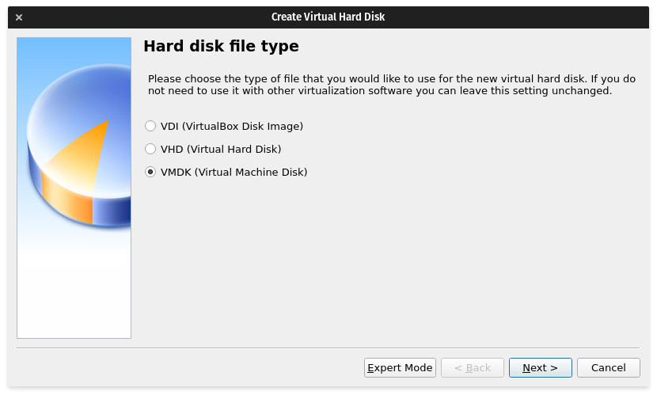


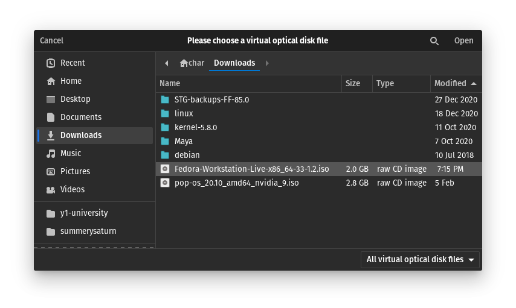


### Step 2: Install the operating system using the ISO

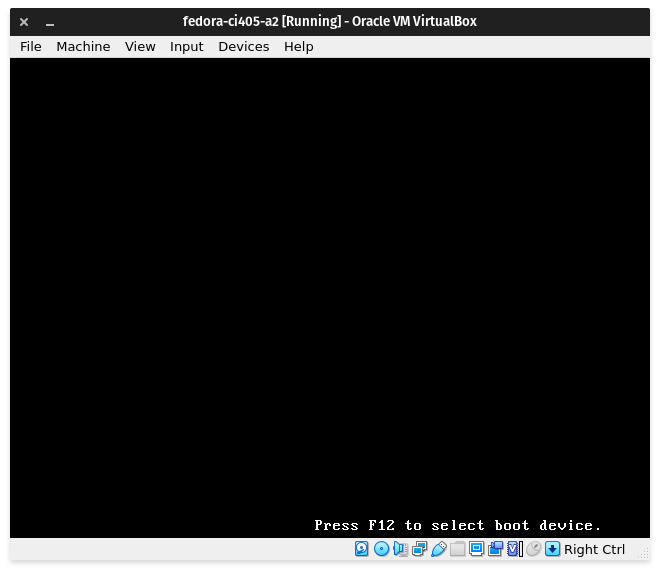
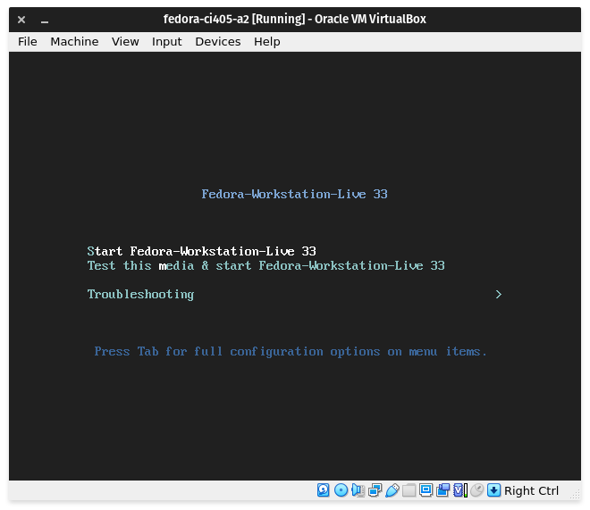


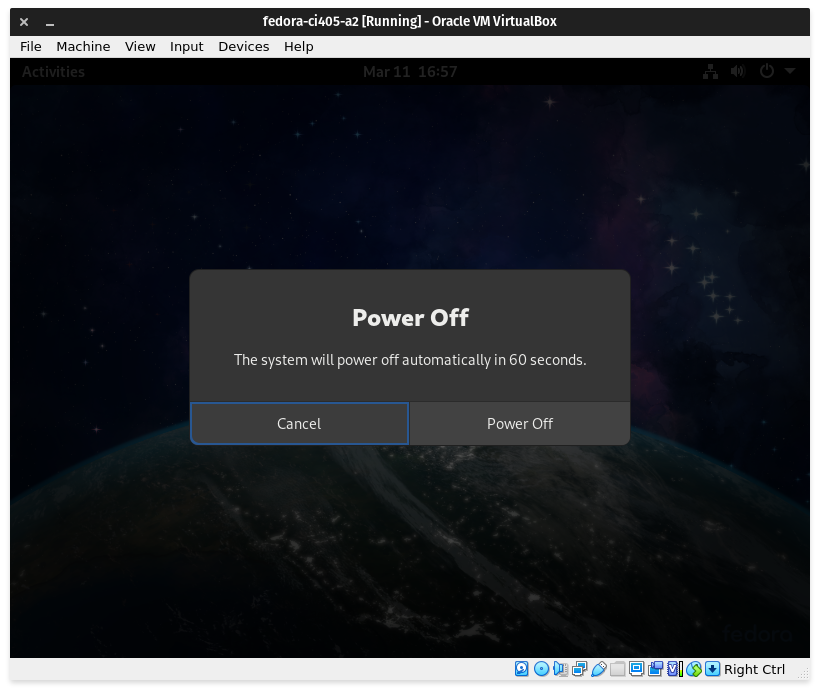


### Step 3: Create a user account and apply updates

Select the correct bootloader in... looks like systemd-boot?

Booting nice and quickly

All okay! Fedora setup looks a lot like Ubuntu
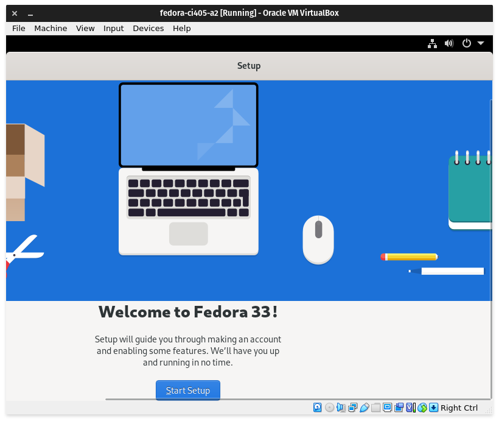
Turn off tracking and such
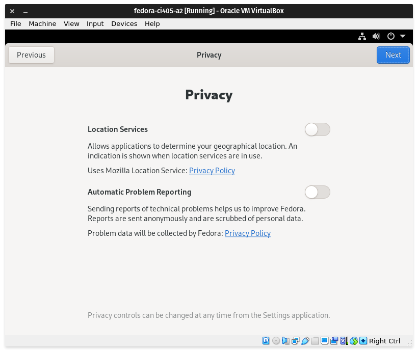
Set up the user name

Set up the user password
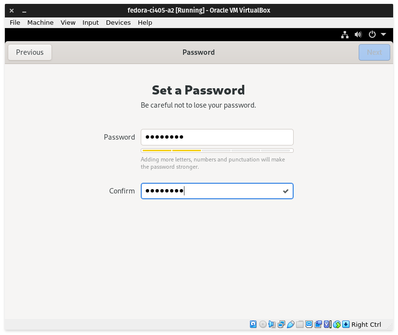
Now to apply updates

Fedora has a nice stock Gnome experience

Lovely old bash

Starting the sudo dnf upgrade

1.1GiB is a lot of data, 800+ packages. Wow.

9 minutes of execution time. wow.


## Week 2 Questions

| Question 1: Explain Moore’s law. Is Moore’s law a Physics law? |
| :------------------------------------------------------------- |

| Question 2: Modern CPUs are measured in nano-metre scale (e.g. 14 nm CPU). What does this number mean? Is this the size of each individual transistor? |
| :----------------------------------------------------------------------------------------------------------------------------------------------------- |

| Question 3: Describe the quantum tunneling problem in the transistor design. |
| :--------------------------------------------------------------------------- |

## Week 2 Lab Work

```plaintext
Task: Performing the following Linux commands, using one of the environments we set up in Week 1.

$ date
$ date > today
$ cat today
$ date >> today
$ cat today
$ cal 1 2010
$ ls
$ ls -l
$ ls -l > files
$ cat *
$ cat p*
$ mkdir mysub
$ ls
$ cd mysub
$ cd ..
$ pwd
$ cd .
$ cd ~
$ ls ~/mysub
$ ls ~
$ ls ~/..
$ cp today tomorrow
$ cd ~/mysub
$ cp ~/tomorrow .
$ ls
$ mv tomorrow files.txt
$ rm files.txt
```

Date, Cat and basic redirection operators

Calendar and Who commands

ls, ls -l commands

ls with redirection operators

cat with wildcard operator

cat with wildcard operator (cont.)

pwd, cd, directory handling

Moving and removing files
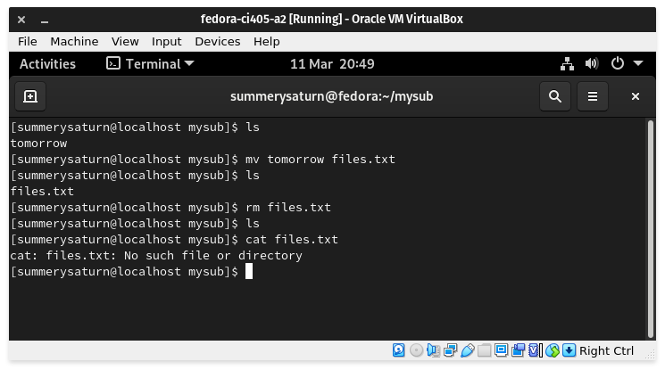

## Week 3 Questions

| Question 1: What is RowHammer? What are the potential solutions? |
| :--------------------------------------------------------------- |

| Question 2: Comparing the three levels of cache. |
| :----------------------------------------------- |

| Question 3: Explain the differences between RAID 1, 5 and 10. |
| :------------------------------------------------------------ |

| Question 4: Describe the concept of processing in memory. |
| :-------------------------------------------------------- |

## Week 3 Lab Work

```plaintext
Task: Performing the following Linux commands, using one of the environments we set up in Week 1.

$ ps -ef
$ sleep 10 &
$ sleep 1000 (then ctrl+z)
$ bg
$ jobs
$ fg %1

$ sleep 100 (then ctrl+c)
$ sleep 100 &
$ jobs
$ kill %1

$ sleep 1000 &
$ ps
$ kill (pid)
$ kill -9 (pid)

$ vi
  Enter the text: "The quick fox jumps over the lazy dog"
  Find a way to save this text into a file “viFile.txt” without quitting.
  Find a way to quit the editor now.
  List the content of this file with the more and the cat commands.

$ wget https://gutenberg.org/files/1661/1661-0.txt
$ head -20 1661-0.txt
```

Basic background processes

Ctrl+Z Operator & bg
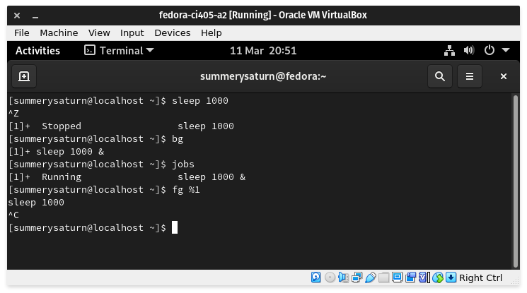
Jobs & killing based on job list

ps command & killing based on pid

vi editing

Writing the vi editor to out (viFile.txt)

Writes ok...

Force quit
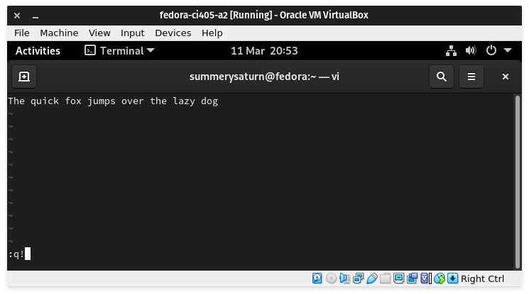
Quit ok...

cat the file

more the file

wget from the directory provided

Showing the file using less
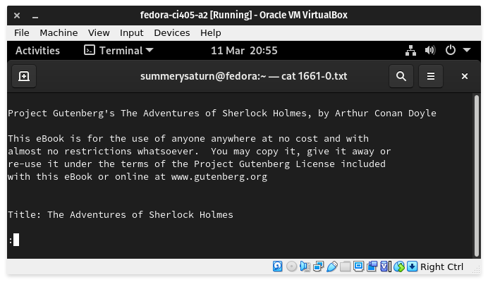
Showing the first 20 lines using head -20

Showing the first 20 lines using head -20
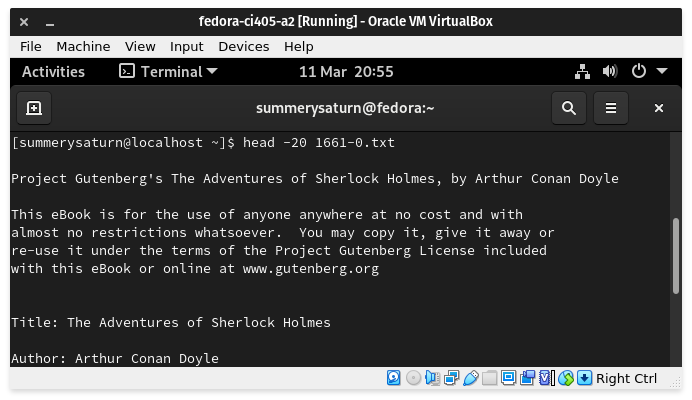

## Week 4 Questions

| Question 1: Explain the difference between a digital sensor and an analog sensor. |
| :-------------------------------------------------------------------------------- |

| Question 2: Describe the responsibilities of the “Cloud processing unit” (the top layer of IoT). |
| :----------------------------------------------------------------------------------------------- |

| Question 3: Explain the difference between a microcontroller (e.g. Arduino) and an embedded board (e.g. Raspberry Pi). |
| :--------------------------------------------------------------------------------------------------------------------- |

## Week 4 Lab Work


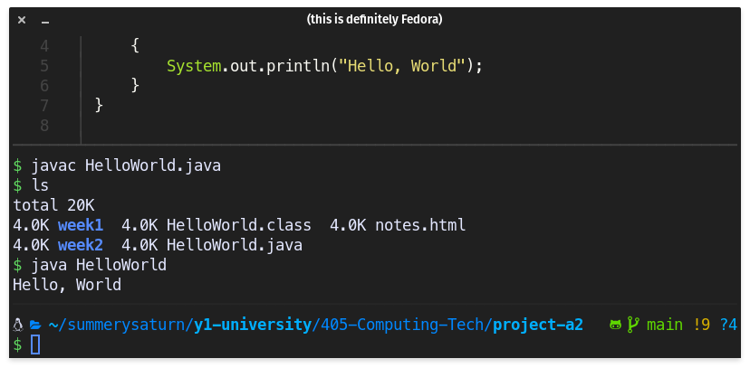
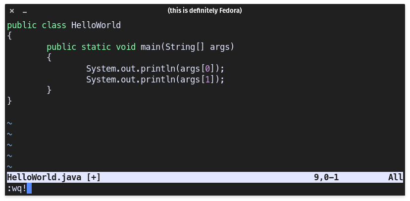


## Week 5 Questions

| Question 1: Describe the challenges facing mobile computing technology. |
| :---------------------------------------------------------------------- |

| Question 2: What is context awareness? Give one example of a context awareness mobile app. |
| :----------------------------------------------------------------------------------------- |

| Question 3: What are the challenges for doing Augmented Reality on a mobile device? |
| :---------------------------------------------------------------------------------- |

## Week 5 Lab Work


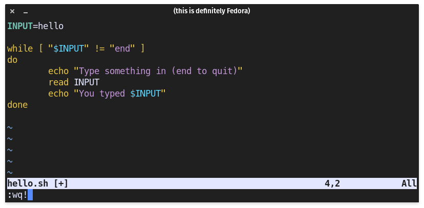
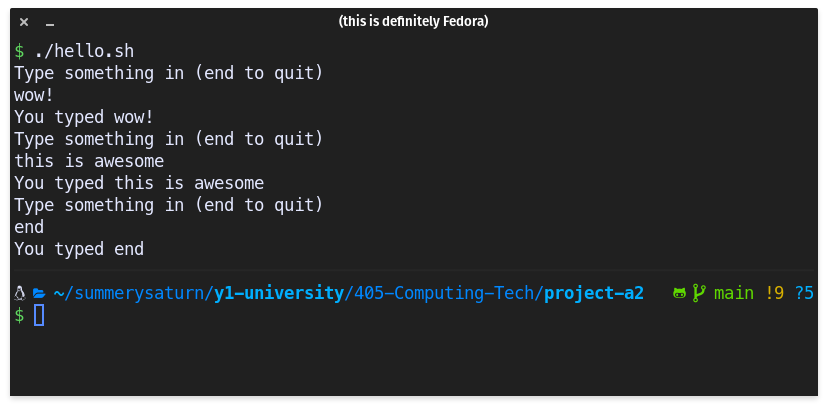
