# CI405 A2 notebook

Charlotte Ward | CI405 Assignment 2 | Year 1 CSG

* [CI405 A2 notebook](#ci405-a2-notebook)
  * [Week 1 Questions](#week-1-questions)
  * [Week 1 Lab Work](#week-1-lab-work)
  * [Week 2 Questions](#week-2-questions)
  * [Week 2 Lab Work](#week-2-lab-work)
  * [Week 3 Questions](#week-3-questions)
  * [Week 3 Lab Work](#week-3-lab-work)
  * [Week 4 Questions](#week-4-questions)
  * [Week 4 Lab Work](#week-4-lab-work)
  * [Week 5 Questions](#week-5-questions)
  * [Week 5 Lab Work](#week-5-lab-work)

## Week 1 Questions

| Question 1: Define the four main components of a computer. |
| :--------------------------------------------------------- |

Input, Processor, Memory, Output.

Other components can be added in to optimise this, but the core concept of a computer (vs. a Turing machine or similar) revolves around Input and Output.

| Question 2: Explain the difference between a fixed program computer and a stored program computer. |
| :------------------------------------------------------------------------------------------------- |

Fixed program computers have a set operation and control flow, whereas stored program computers can be modified before, during and after execution. Fixed program computers can be very simple and cheap, whereas stored program computers are more complex but more versatile. Most modern computers are stored program computers, whereas IOT devices and chipsets are often stored program computers.

| Question 3: What is Gordon Bell’s law about the near future of computer class? |
| :----------------------------------------------------------------------------- |

Gordon Bell's law determines the scale and ubiquity of computer systems, explaining how computers are getting smaller and more prolific in society. He describes that Mainframe computers were initially the most important,

## Week 1 Lab Work

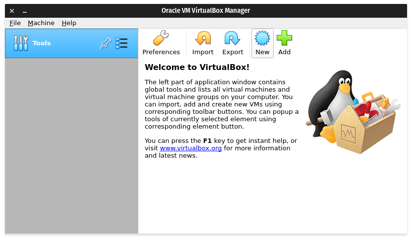
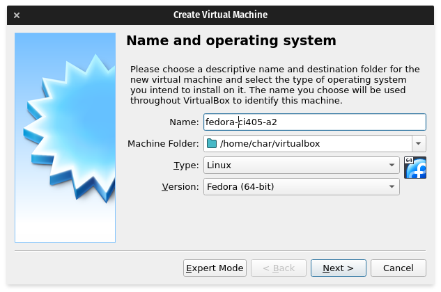
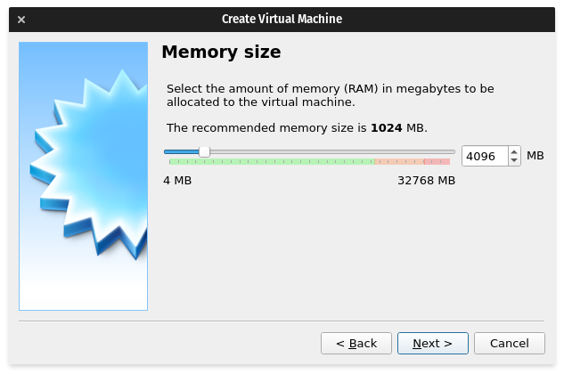

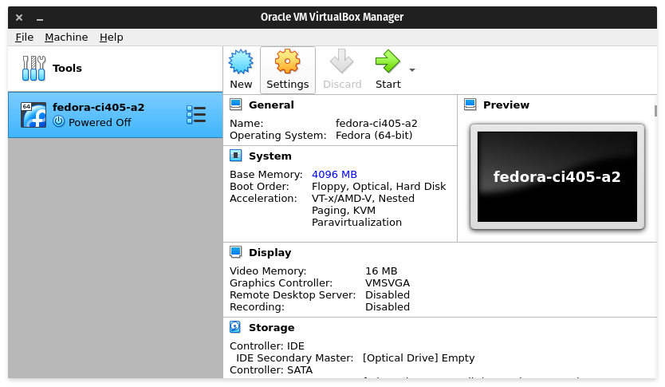

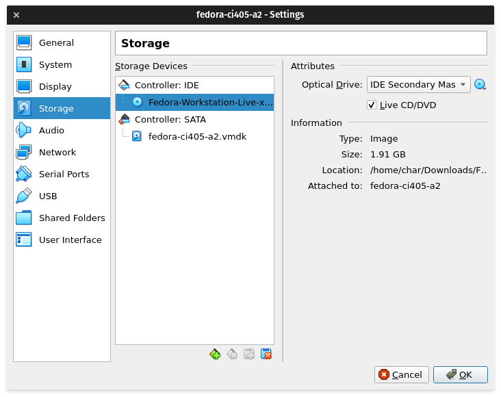

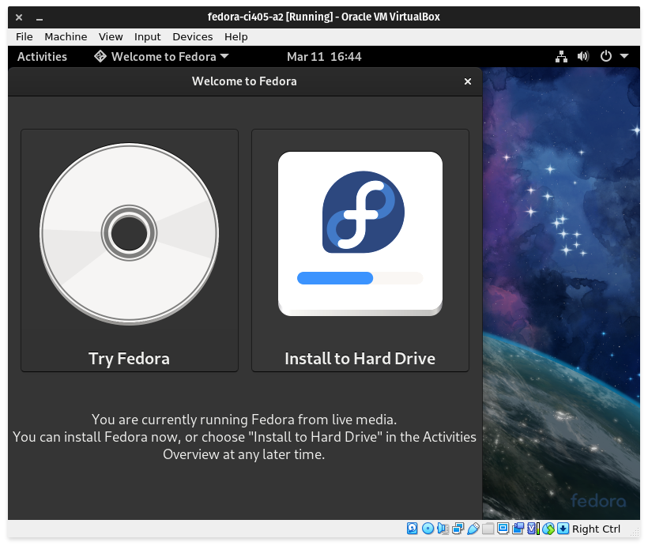
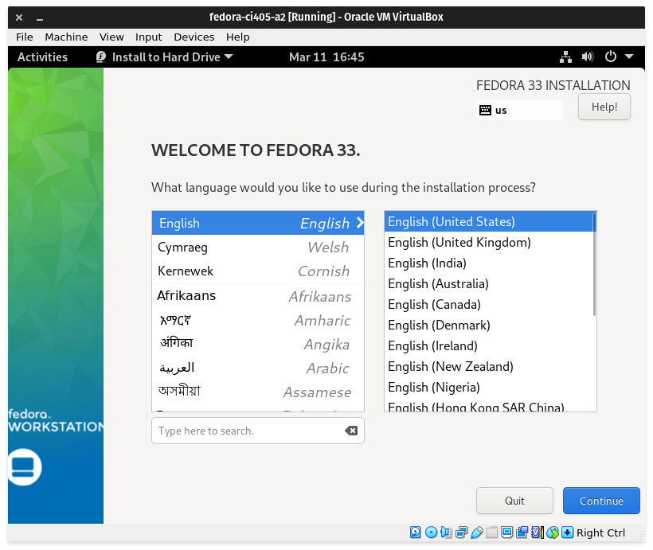
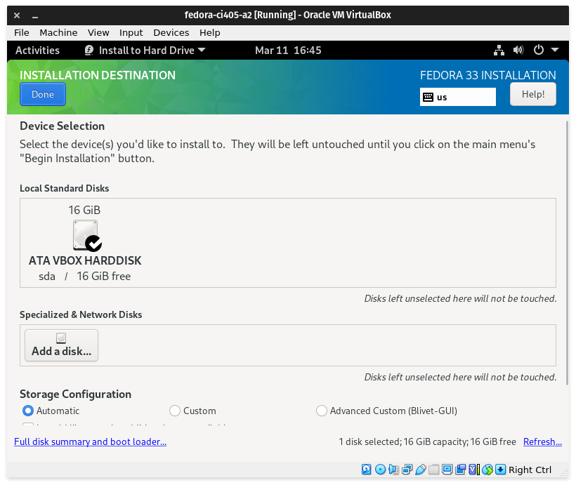

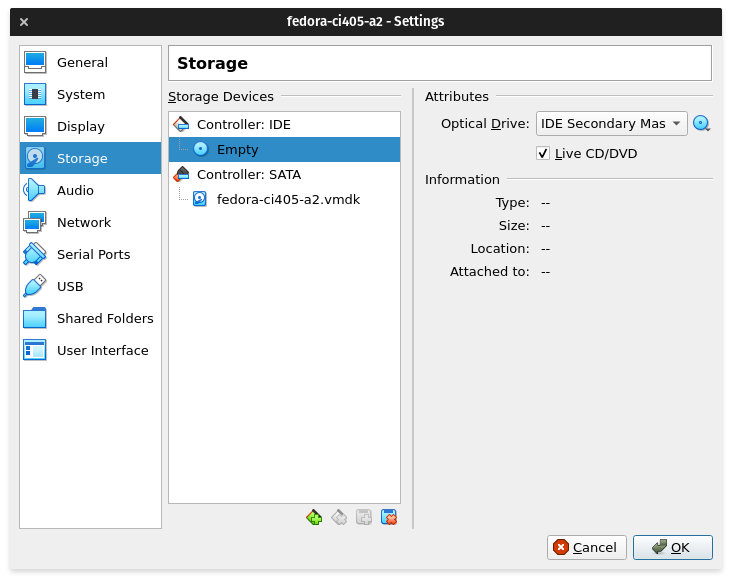

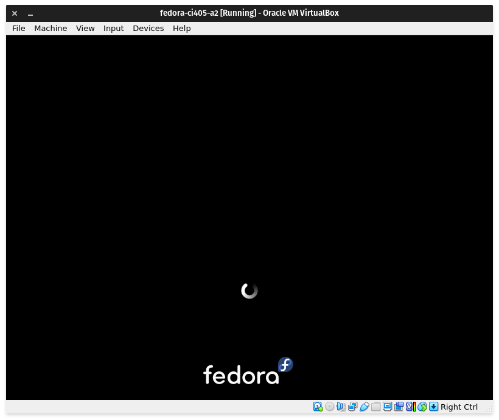

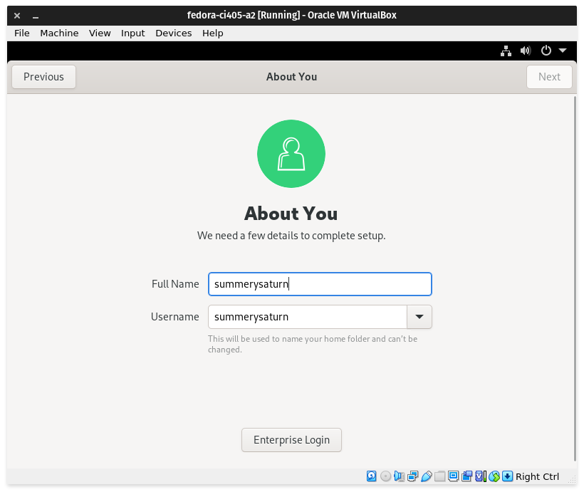

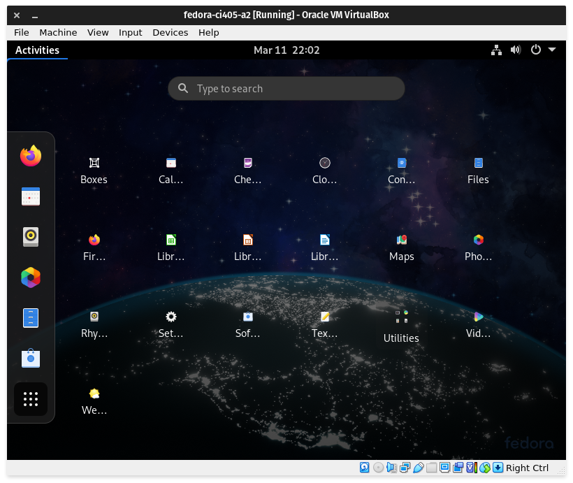

## Week 2 Questions

| Question 1: Explain Moore’s law. Is Moore’s law a Physics law? |
| :------------------------------------------------------------- |

| Question 2: Modern CPUs are measured in nano-metre scale (e.g. 14 nm CPU). What does this number mean? Is this the size of each individual transistor? |
| :----------------------------------------------------------------------------------------------------------------------------------------------------- |

| Question 3: Describe the quantum tunneling problem in the transistor design. |
| :--------------------------------------------------------------------------- |

## Week 2 Lab Work

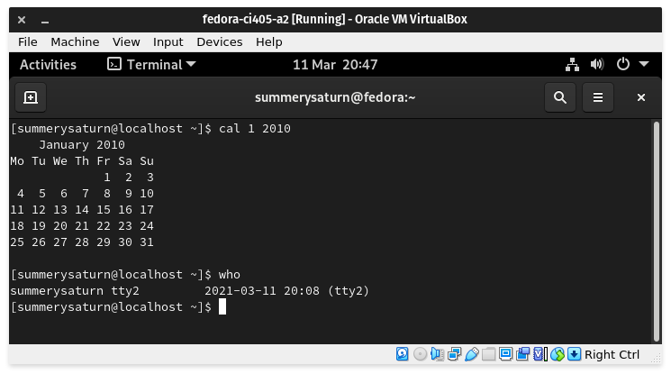

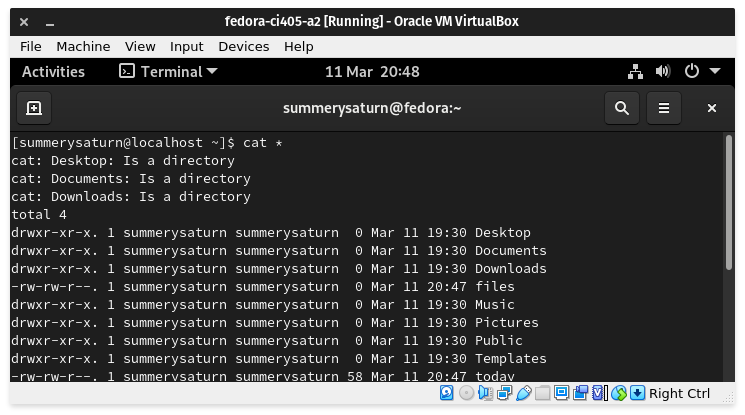

## Week 3 Questions

| Question 1: What is RowHammer? What are the potential solutions? |
| :--------------------------------------------------------------- |

| Question 2: Comparing the three levels of cache. |
| :----------------------------------------------- |

| Question 3: Explain the differences between RAID 1, 5 and 10. |
| :------------------------------------------------------------ |

| Question 4: Describe the concept of processing in memory. |
| :-------------------------------------------------------- |

## Week 3 Lab Work

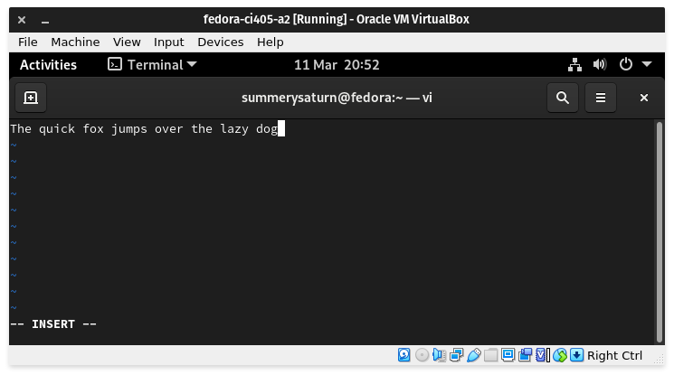
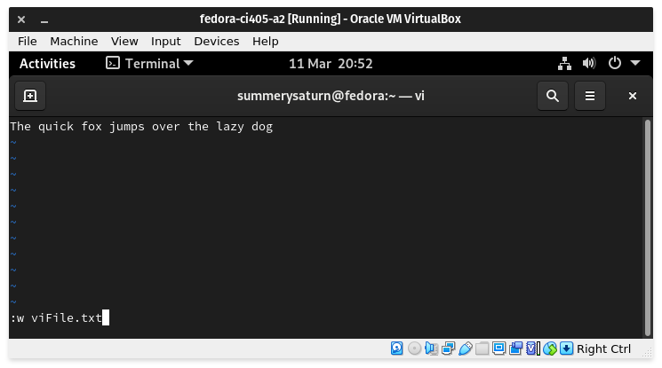

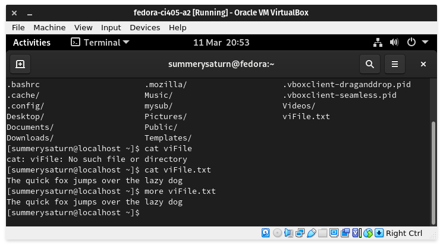

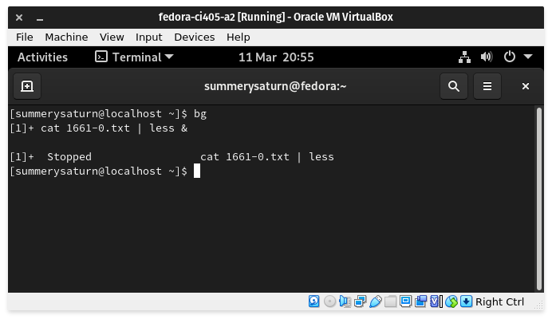

## Week 4 Questions

| Question 1: Explain the difference between a digital sensor and an analog sensor. |
| :-------------------------------------------------------------------------------- |

| Question 2: Describe the responsibilities of the “Cloud processing unit” (the top layer of IoT). |
| :----------------------------------------------------------------------------------------------- |

| Question 3: Explain the difference between a microcontroller (e.g. Arduino) and an embedded board (e.g. Raspberry Pi). |
| :--------------------------------------------------------------------------------------------------------------------- |

## Week 4 Lab Work

## Week 5 Questions

| Question 1: Describe the challenges facing mobile computing technology. |
| :---------------------------------------------------------------------- |

| Question 2: What is context awareness? Give one example of a context awareness mobile app. |
| :----------------------------------------------------------------------------------------- |

| Question 3: What are the challenges for doing Augmented Reality on a mobile device? |
| :---------------------------------------------------------------------------------- |

## Week 5 Lab Work

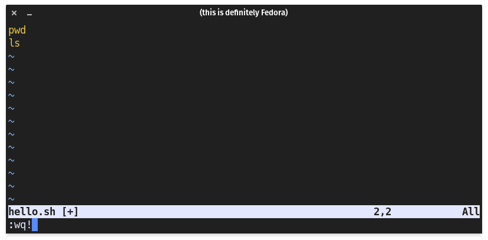

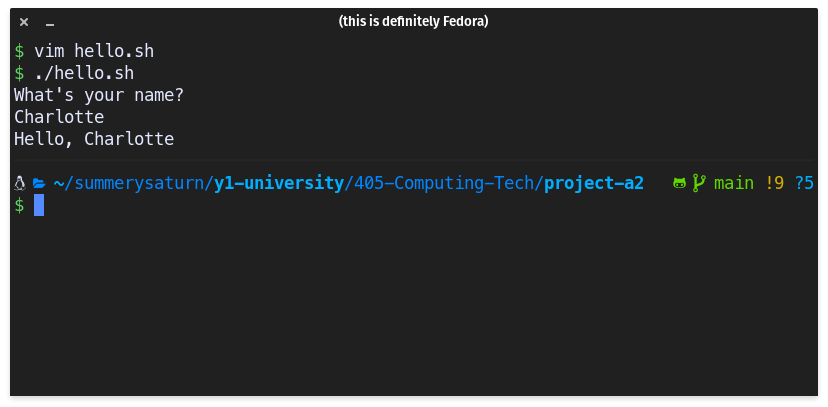

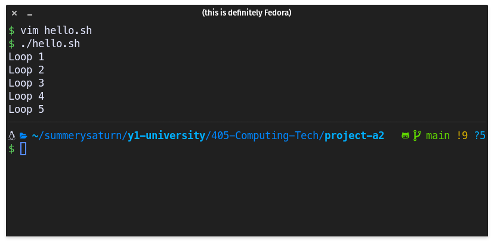

